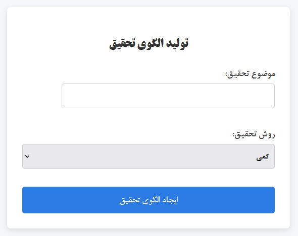
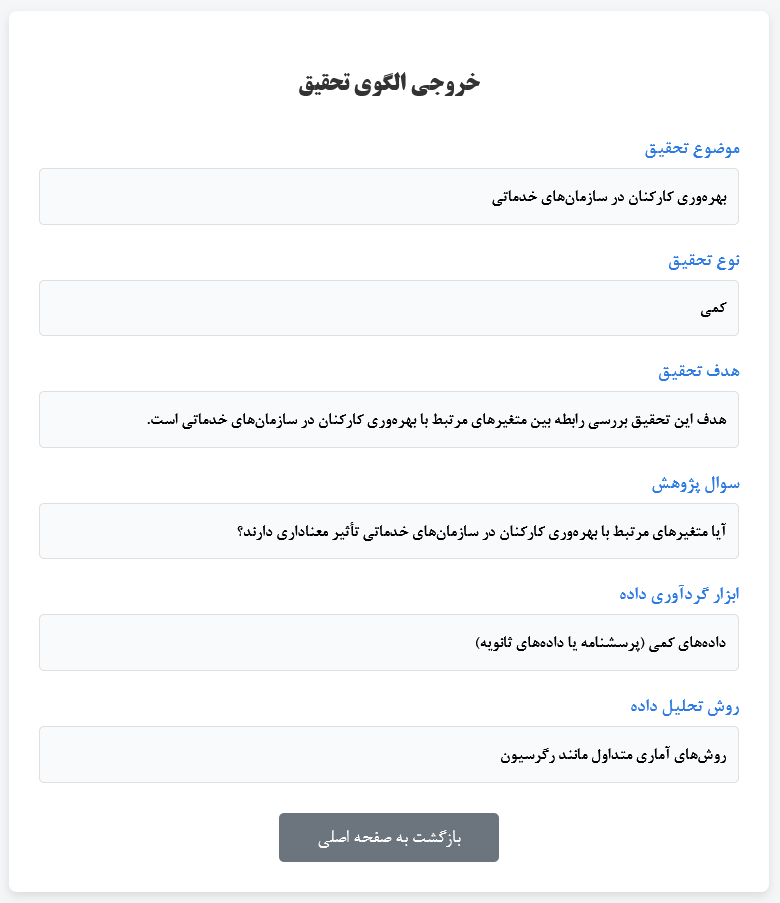
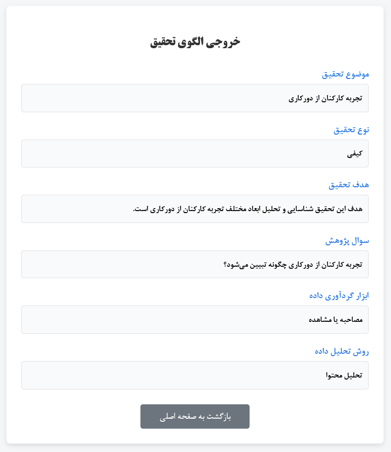

## 📘 برنامه تولید الگوی تحقیق (Research Template Generator)

این پروژه یک وب‌اپلیکیشن ساده مبتنی بر **Django** است که با هدف کمک آموزشی در درس **روش تحقیق** طراحی شده است.
کاربر با وارد کردن **موضوع تحقیق** و انتخاب **نوع روش تحقیق (کمی یا کیفی)**، یک الگوی اولیه شامل هدف، سؤال پژوهش، ابزار گردآوری داده و روش تحلیل دریافت می‌کند.

## 🎯 هدف پروژه

هدف اصلی این پروژه:

* آشنایی دانشجویان با ساختار اولیه یک طرح تحقیق
* تمرین عملی مباحث درس روش تحقیق

این پروژه در قالب تمرین درس **روش تحقیق** توسعه داده شده است.

## 🛠️ فناوری‌های استفاده‌شده

* Python 3
* Django 5.2
* HTML / CSS

## ⚙️ امکانات برنامه

* دریافت موضوع تحقیق از کاربر
* انتخاب نوع تحقیق:

  * تحقیق **کمی**
  * تحقیق **کیفی**
* تولید خودکار موارد زیر:

  * نوع تحقیق
  * هدف تحقیق
  * سؤال پژوهش
  * ابزار گردآوری داده
  * روش تحلیل داده
* رابط کاربری فارسی و راست‌به‌چپ (RTL)

## 📷 تصاویر برنامه

 | تصویر | بخش برنامه |
|:---:|:---:|
|  | صفحه اصلی |
|  | خروجی روش تحقیق کمی |
|  | خروجی روش تحقیق کیفی |

## 📂 ساختار کلی پروژه

```
simple_research_planner/
│
├── planner/
│   ├── forms.py        # فرم دریافت اطلاعات تحقیق
│   ├── views.py        # منطق اصلی برنامه
│   ├── urls.py         # مسیریابی
│   └── apps.py
│
├── templates/
│   ├── home.html       # صفحه ورود اطلاعات
│   └── result.html     # صفحه نمایش خروجی تحقیق
│
├── simple_research_planner
│   ├── asgi.py
│   ├── settings.py
│   └── wsgi.py
│
└── manage.py
```

## ▶️ نحوه اجرا

1. نصب پیش‌نیازها:

```bash
pip install -r requirements.txt
```

2. اجرای سرور:

```bash
python manage.py runserver
```

3. باز کردن برنامه در مرورگر:

```
http://127.0.0.1:8000/
```

## 🧠 توضیح منطق برنامه

* در فایل `forms.py`، فرم دریافت **موضوع تحقیق** و **روش تحقیق** تعریف شده است.
* در `views.py`، پس از ارسال فرم:

  * داده‌ها اعتبارسنجی می‌شوند
  * بر اساس نوع تحقیق (کمی یا کیفی)، یک الگوی مناسب تولید می‌شود
* خروجی نهایی در قالب یک صفحه HTML به کاربر نمایش داده می‌شود.

## 📌 کاربرد آموزشی

این پروژه می‌تواند به عنوان:

* ابزار کمک‌آموزشی برای دانشجویان
* نمونه پروژه ساده Django
* تمرین عملی برای درس روش تحقیق

مورد استفاده قرار گیرد.

## 👤 توسعه‌دهنده

* پروژه درسی – درس روش تحقیق

## 📄 مجوز

این پروژه صرفاً با هدف **آموزشی** تهیه شده و استفاده از آن آزاد است.
